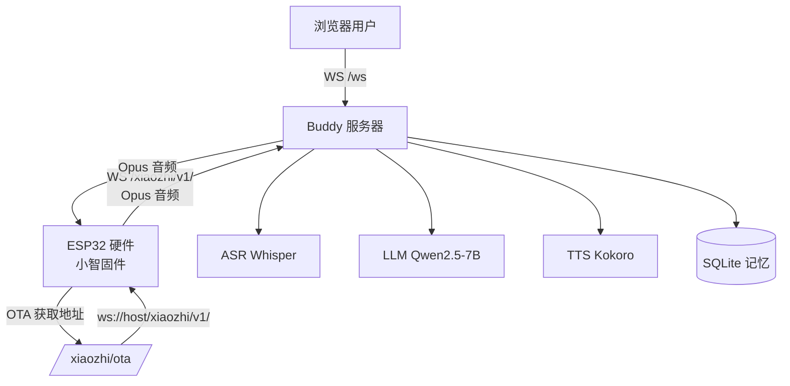

# English Buddy

AI 英语口语陪练助手。支持实时语音对话，兼容小智（Xiaozhi）ESP32 硬件协议，浏览器和硬件端都能连接。

## 项目架构



## 项目结构

```
english-buddy/
├── src/buddy/           # 核心包
│   ├── server.py        # FastAPI 服务（HTTP + WebSocket + Xiaozhi 协议）
│   ├── core.py          # vLLM 串行队列
│   ├── asr.py           # 语音识别 (Sherpa-ONNX Whisper)
│   ├── prompt.py        # Persona x Level x Skills 动态 Prompt
│   ├── vad.py           # 语音活动检测
│   ├── xiaozhi_codec.py # 小智协议兼容（Opus 编解码 + Hello/Listen/TTS 状态机）
│   ├── memory/          # SQLite 记忆系统
│   └── tts/             # TTS 引擎
├── static/index.html    # 浏览器前端
├── client.py            # 本地 Python 客户端
├── Dockerfile           # 容器部署
└── requirements.txt     # 依赖清单
```

## 快速开始

### 本地 Mock 测试（无需 GPU）

```bash
cd english-buddy
set BUDDY_MOCK=1
python -m uvicorn src.buddy.server:app --host 127.0.0.1 --port 8080
```

浏览器打开 http://localhost:8080

### 服务器部署（GPU 环境）

```bash
conda activate agent-dev
cd english-buddy
pip install -r requirements.txt
pip install opuslib_next

export BUDDY_LLM_PATH="/path/to/Qwen2.5-7B-Instruct"
export BUDDY_ASR_DIR="/path/to/sherpa-onnx-whisper-base"
export BUDDY_KOKORO_DIR="/path/to/kokoro-multi-lang-v1_1"
python -m uvicorn src.buddy.server:app --host 0.0.0.0 --port 6006
```

## 如何连接硬件（ESP32）

本项目兼容小智（Xiaozhi）ESP32 硬件协议。刷了小智固件的 ESP32 可以通过 OTA 自动发现我们的服务器。

### 流程

```
ESP32 开机
  → POST /xiaozhi/ota/ 询问 WebSocket 地址
  → 服务器返回 ws://host:port/xiaozhi/v1/
  → ESP32 连接该 WebSocket
  → 发 hello 握手 → 发 listen start → 发 Opus 音频帧
  → 服务器解码 Opus → ASR → LLM → TTS → 编码 Opus
  → 返回 tts start → Opus 音频帧 → tts stop
  → ESP32 播放语音
```

### 接口地址

| 接口 | 说明 |
|------|------|
| `POST /xiaozhi/ota/` | OTA 配置接口，返回 WebSocket 地址 |
| `WebSocket /xiaozhi/v1/` | 小智协议 WebSocket 端点 |
| `POST /set_persona` | 切换人格（HTTP） |
| `POST /chat` | HTTP 音频上传→音频流返回 |
| `WebSocket /ws` | 浏览器实时对话 WebSocket |

## 使用文档

### 配置项（环境变量）

| 变量 | 说明 |
|------|------|
| `BUDDY_MOCK=1` | Mock 模式，无需 GPU |
| `BUDDY_LLM_PATH` | LLM 模型路径 |
| `BUDDY_ASR_DIR` | ASR 模型目录 |
| `BUDDY_KOKORO_DIR` | TTS 模型目录 |
| `BUDDY_DB_PATH` | 记忆数据库路径 |

### WebSocket 协议

**/ws（浏览器）：**
- 客户端发送 16-bit PCM 音频（16000Hz）
- 服务器返回 JSON 控制消息 + 16-bit PCM 音频（24000Hz）

**/xiaozhi/v1/（ESP32）：**
- 客户端发送 Opus 编码音频帧（详见 Xiaozhi 协议文档）
- 支持二进制协议 v1（裸 Opus）和 v2（16 字节头部 + 时间戳）
- JSON 消息：hello、listen start/stop、abort、ping/pong
- 服务器回复：hello、stt、tts start/stop、pong

## 参考

- [Milky997/buddy](https://github.com/Milky997/buddy) - 我们的仓库
- [78/xiaozhi-esp32](https://github.com/78/xiaozhi-esp32) - 小智 ESP32 硬件固件
- [xinnan-tech/xiaozhi-esp32-server](https://github.com/xinnan-tech/xiaozhi-esp32-server) - 小智 Python 服务端参考
